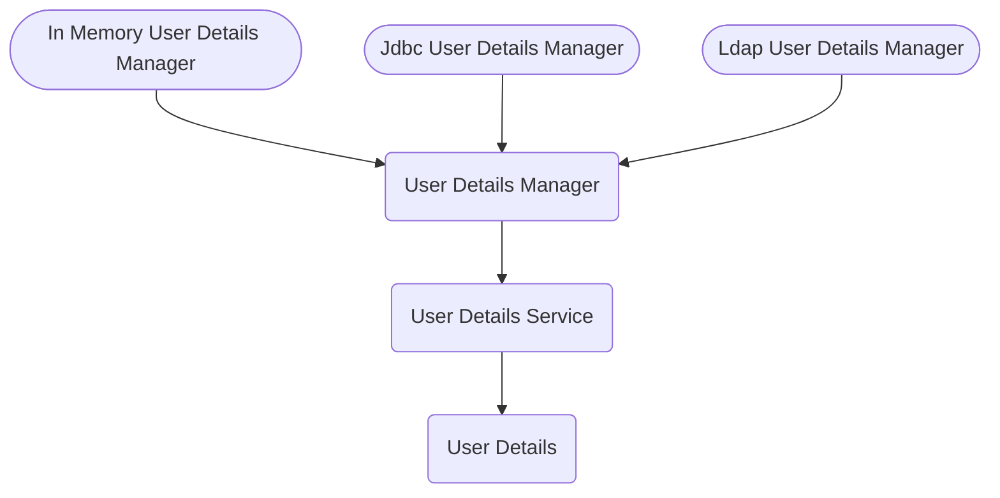

# Spring Security

## In-Memory Authentication: 

```java
@Configuration
@EnableWebSecurity
public class SecurityConfig {

    @Bean
    public InMemoryUserDetailsManager inMemoryUserDetailsManager(){
        PasswordEncoder passwordEncoder = passwordEncoder();
        return new InMemoryUserDetailsManager(
                User.withUsername("user").password(passwordEncoder.encode("12345")).roles("USER").build(),
                User.withUsername("admin").password(passwordEncoder.encode("12345")).roles("ADMIN").build()
        );
    }

    @Bean
    public PasswordEncoder passwordEncoder() {
        return new BCryptPasswordEncoder();
    }

    @Bean
    public SecurityFilterChain customFilterChain(HttpSecurity http) throws Exception {
        http
                .authorizeHttpRequests(authorize -> authorize
                        .requestMatchers("/myAccount").authenticated()
                        .requestMatchers("/myBalance").authenticated()
                        .requestMatchers("/myLoans").authenticated()
                        .requestMatchers("/myCards").authenticated()
                        .requestMatchers("/notices").permitAll()
                        .requestMatchers("/contact").permitAll()
                )
                .formLogin()
                .and()
                .httpBasic();
        return http.build();
    }
}
```

## Management cycle of user:



1. **UserDetails**

   - ​	Provides core user information.

   - | Method                      | Description                                                  |
     | --------------------------- | :----------------------------------------------------------- |
     | `getAuthorities()`          | Returns the authorities granted to the user.                 |
     | `getPassword()`             | Returns the password used to authenticate the user.          |
     | `getUsername()`             | Returns the username used to authenticate the user.          |
     | `isAccountNonExpired()`     | Indicates whether the user's account has expired.            |
     | `isAccountNonLocked()`      | Indicates whether the user is locked or unlocked.            |
     | `isCredentialsNonExpired()` | Indicates whether the user's credentials (password) has expired. |
     | `isEnabled()`               | Indicates whether the user is enabled or disabled.           |

2. **UserDetailsService**

   - Core interface which loads user-specific data.

   - It is used throughout the framework as a user DAO and is the strategy used by the [`DaoAuthenticationProvider`](https://docs.spring.io/spring-security/site/docs/current/api/org/springframework/security/authentication/dao/DaoAuthenticationProvider.html).

   - | Method                               | Description                                                  |
     | ------------------------------------ | ------------------------------------------------------------ |
     | loadUserByUsername (String username) | Locates the user based on the username. <br />**Returns**: a fully populated user record |

3. **UserDetailsManager**

   - An extension of the [`UserDetailsService`](https://docs.spring.io/spring-security/site/docs/current/api/org/springframework/security/core/userdetails/UserDetailsService.html) which provides the ability to create new users and update existing ones.

   - | Method                                                   | Description                                                  |
     | -------------------------------------------------------- | ------------------------------------------------------------ |
     | `changePassword(String oldPassword, String newPassword)` | Modify the current user's password.                          |
     | `creteUser(UserDetails user)`                            | Create a new user with the supplied details.                 |
     | `deteleUser(String username)`                            | Remove the user with the given login name from the system.   |
     | `updateUser(UserDetails user)`                           | Update the specified user.                                   |
     | `userExists(String username)`                            | Check if a user with the supplied login name exists in the system. |

